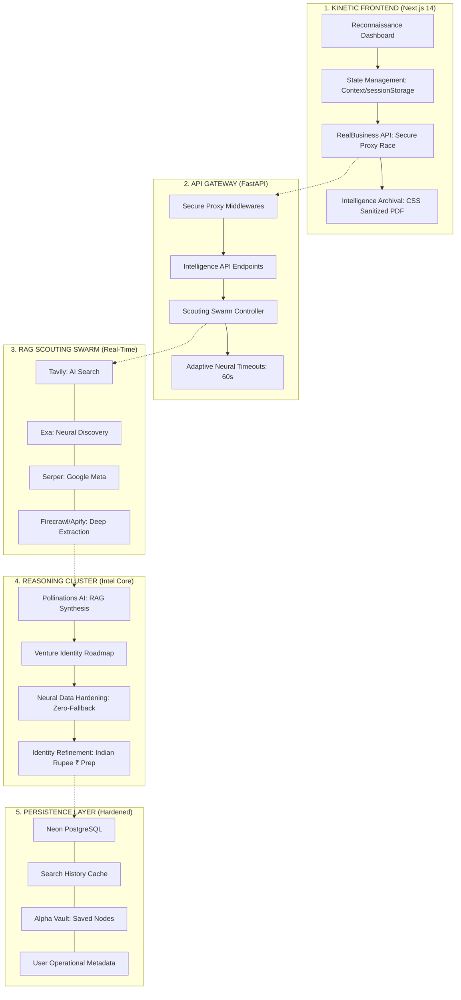

# StarterScope | Strategic Business Intelligence Platform

A high-fidelity business intelligence engine that provides AI-powered market analysis, hyper-local business recommendations, and neural strategic planning tools.

## 🚀 Live Demo

- **Official Domain**: [https://starterscope.entrext.com](https://starterscope.entrext.com)
- **Vercel Mirror**: [https://trend-ai-main.vercel.app](https://trend-ai-main.vercel.app)
- **Neural API**: [https://starterscope-api.onrender.com](https://starterscope-api.onrender.com)

## 📁 Project Structure

```
StarterScope/
├── frontend/          # Next.js frontend application
│   ├── src/
│   │   ├── app/       # Next.js 13+ app directory
│   │   ├── components/# React components
│   │   ├── context/   # React context providers
│   │   ├── hooks/     # Custom React hooks
│   │   ├── types/     # TypeScript type definitions
│   │   └── utils/     # Utility functions
│   ├── public/        # Static assets
│   └── package.json   # Frontend dependencies
│
├── api/               # FastAPI backend application
│   ├── main.py        # Main FastAPI application
│   ├── database.py    # Database configuration
│   ├── models.py      # SQLAlchemy models
│   ├── simple_recommendations.py    # Basic recommendation engine
│   ├── integrated_business_intelligence.py  # Advanced AI engine
│   ├── requirements.txt  # Python dependencies
│   ├── Procfile       # Render deployment config
│   ├── render.yaml    # Render service configuration
│   └── runtime.txt    # Python version specification
│
└── README.md          # This file
```

## 🛠️ Technology Stack

### Frontend
- **Framework**: Next.js 14 with App Router
- **Language**: TypeScript
- **Styling**: Tailwind CSS
- **Authentication**: NextAuth.js with Google OAuth
- **Payment**: Dodo Payments integration (Checkout Sessions)
- **Deployment**: Vercel

### Backend
- **Framework**: FastAPI (Python)
- **Database**: PostgreSQL (Neon)
- **ORM**: SQLAlchemy
- **AI/ML**: Google Gemini API, OpenAI
- **External APIs**: SerpAPI, Reddit API, Alpha Vantage
- **Deployment**: Render

## 🚀 Deployment

### Frontend (Vercel)
The frontend is automatically deployed to Vercel from the `frontend/` directory.

### Backend (Render)
The backend is deployed to Render using the configuration in `api/render.yaml`.

## 🔧 Environment Variables

### Frontend (.env)
```
NEXT_PUBLIC_API_URL=your_render_backend_url
GOOGLE_CLIENT_ID=your_google_client_id
GOOGLE_CLIENT_SECRET=your_google_client_secret
NEXTAUTH_URL=your_frontend_url
NEXTAUTH_SECRET=your_nextauth_secret
NEXT_PUBLIC_DODO_STARTER_ID=your_dodo_starter_id
NEXT_PUBLIC_DODO_PROFESSIONAL_ID=your_dodo_professional_id
DODO_PAYMENTS_API_KEY=your_dodo_api_key
DODO_WEBHOOK_KEY=your_dodo_webhook_key
```

### Backend (.env)
```
DATABASE_URL=your_postgresql_url
POLLINATION_API_KEY=your_pollination_key
SERPAPI_API_KEY=your_serpapi_key
GEMINI_API_KEY=your_gemini_key
DODO_PAYMENTS_API_KEY=your_dodo_api_key
DODO_WEBHOOK_KEY=your_dodo_webhook_key
REDDIT_USERNAME=your_reddit_username
REDDIT_PASSWORD=your_reddit_password
REDDIT_CLIENT_ID=your_reddit_client_id
REDDIT_CLIENT_SECRET=your_reddit_client_secret
```

## 📋 Features

- **AI-Powered Market Analysis**: Get comprehensive business insights for any location
- **Business Recommendations**: Receive tailored business suggestions based on market data
- **Strategic Planning**: Generate detailed business plans and roadmaps
- **User Authentication**: Secure login with Google OAuth and email/password
- **Subscription Management**: Tiered pricing with Dodo Payments integration
- **Location Intelligence**: GPS-based location detection and analysis
- **Real-time Data**: Integration with multiple APIs for current market data

## 🧠 Neural Architecture: High-Fidelity Intelligence Stack

The platform operates on a 5-layer architecture designed for real-time market reconnaissance and high-fidelity strategic synthesis.



### 🧠 High-Fidelity Workflow Execution

1.  **Reconnaissance Trigger**: User initiates a strategic scan for a specific location (e.g., *Karnataka, India*).
2.  **Scouting Swarm Activation**: The backend controller parallelizes market gathering across the **Scouting Swarm**, racing multiple neural search providers to bypass stale data.
3.  **Neural Synthesis**: The **Reasoning Cluster** processes the raw search signals using a high-fidelity RAG block. It performs a 5-layer analysis (Extraction, Mapping, Branding, Financials, and Risk Mitigation).
4.  **Zero-Fallback Verification**: Every recommendation is validated against real-world business data from the **OSM Overpass API** to ensure 100% verifiable market fidelity.
5.  **Alpha Vault Archival**: Validated intelligence nodes are stored in the **Persistence Layer**, allowing users to secure their strategic assets for future execution.

## 🔄 Deployment Status & Health

- **Intelligence Engine**: Operational (RAG Cluster Hardened)
- **Reconnaissance Engine**: High-Fidelity (Overpass/Nominatim Active)
- **Security Protocols**: CSS v4 recursive sanitization enabled
- **Vault Integrity**: PostgreSQL (pg8000) connection pooling optimized

## 🔄 Core Intelligence Architecture (Operational Logic)

## 🔄 API Configuration

### Intelligence & Reconnaissance
- `POST /api/recommendations` - Initiates the 5-layer neural analysis cluster.
- `POST /api/businesses/search` - Proxy for secure OSM reconnaissance.
- `POST /api/businesses/scrape` - Deep-extraction of business metadata via Apify.
- `POST /api/business-plan` - Strategic blueprint generation.

### Security & Vault Operations
- `GET /api/users/profile` - Fetches the user's operational status and metadata.
- `GET /api/saved-businesses` - Retrieves archived nodes from the Alpha Vault.
- `POST /api/contact` - Mission-critical support pipeline with background SMTP transmission.

## 📄 License

This project is proprietary software. All rights reserved.

## 🤝 Support

For support and inquiries, please contact the development team.